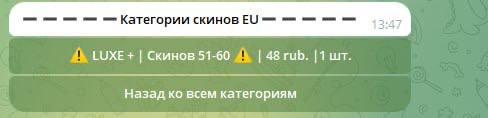

# Telegram Shop

#### *Telegram Shop* - функциональный магазин по продаже цифровых аккаунтов формата.


___
## Функционал

1. ***Оплата прямо через бота*** \

     

   + *Подробная информация для оплаты*
   + *Автоматическая проверка платежа*
     + Отклоненение платежа по времени оплаты
     + Уведомление пользователя
  
   + *Методы оплаты*
     + CrystalPay
     + YooMoney
     + CryptoPay

2. ***Автоматическая выдача товара*** \
     

    + После оплаты , бот автоматически выдаст .txt с нужным товаром и его кол-вом.
  
3. ***Просмотр истории покупок*** \
  

    + Полное управление своими оплаченными заказами.
  

4. ***Удобный вывод категорий и товаров категорий*** \
     
     

    + Вывод каталога товаров пагинацией без спама сообщений
  

5. ***Админ панель*** \
    

    + Полный контроль администратором над ботом


## Настройка

Создать  ```.env``` файл и указать все переменные из ```.config```

Запустить  ```main.py```